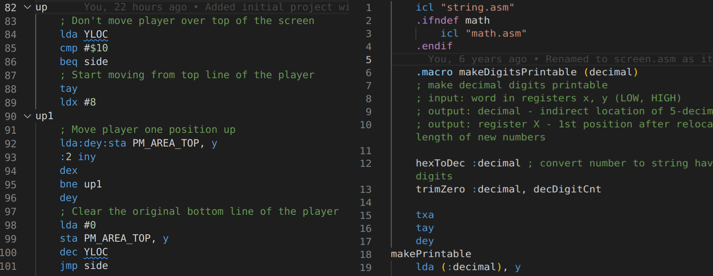

# MADS assembly

It provides syntax highlighting for [MADS](http://mads.atari8.info/), powerful multi-pass cross assembler designed for 6502 and 65816 processors.

## Features

It supports all features of MADS v2.0.6

-----------------------------------------------------------------------------------------------------------
**Go ATARI !**